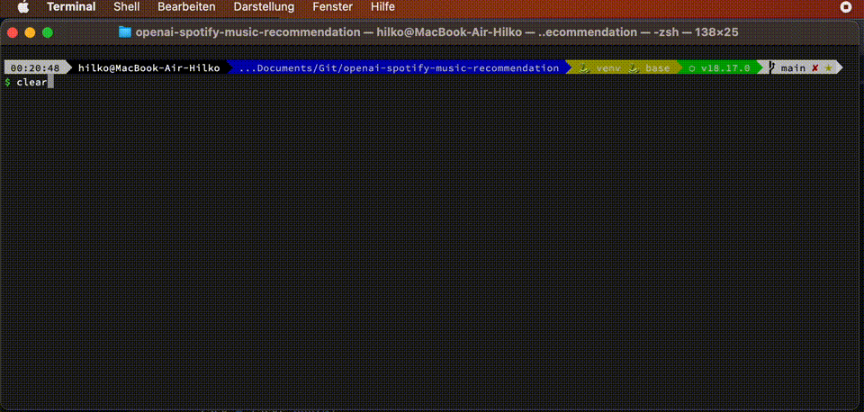

# OpenAI Spotify Music Recommendation 🎶🤖
This is a test project designed to showcase the capabilities of the OpenAI ChatGPT API. With this tool, you can interact with a chatbot that specializes in recommending new songs for your playlist. The bot takes into consideration your favorite music genre and, if you desire, an existing Spotify Playlist.

## How to Use

To get started, simply follow these steps:

1. Sign up and obtain an API key from OpenAI.
2. Install the necessary dependencies by running `pip install -r requirements.in`.
3. Create a .env file with the following content:
    OPENAI_API_KEY="sk..."
    SPOTIPY_CLIENT_ID=""
    SPOTIPY_CLIENT_SECRET=""
    SPOTIPY_REDIRECT_URI="http://127.0.0.1:9090"
4. Run the `main.py` script.

## How it works in the background ⚙️
1. The user chats with the first chatbot (`SpotifyInformationGatheringChat` in Code)
2. After the information has been collected, the `SpotifyInformationGatheringChat` outputs a json with the information which we parse
3. We use the json to retrieve the songs from the Spotify Playlist
4. We feed the songs from the spotify playlist + name + favourite genre back into the bot and let it generate new suggestions

## GIF 📸
